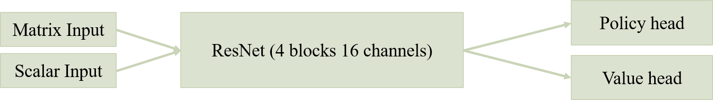
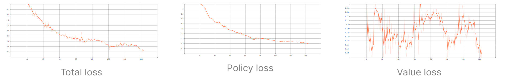
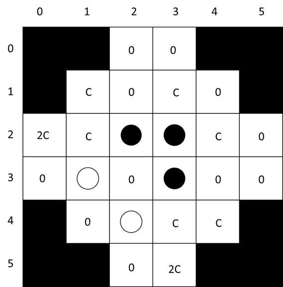
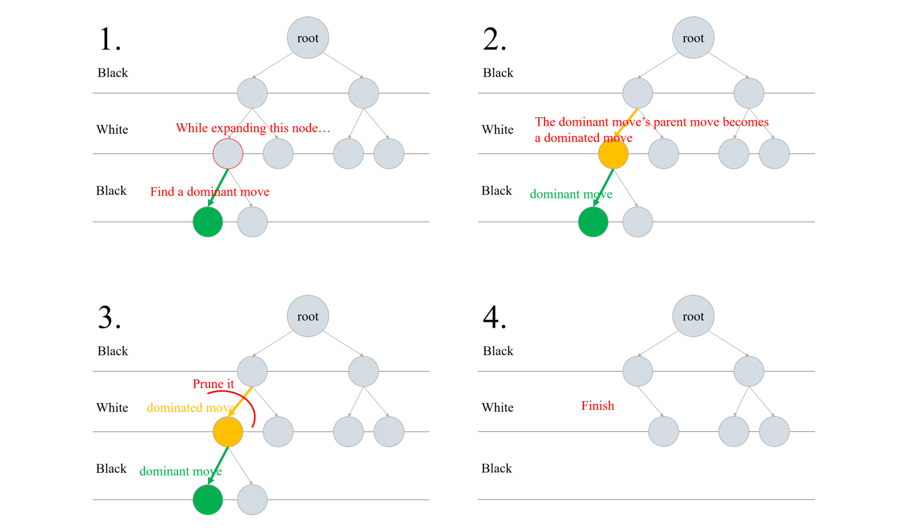
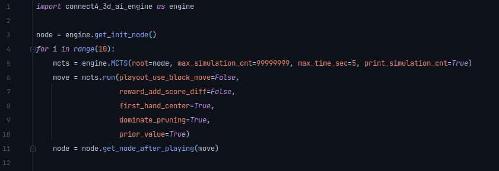
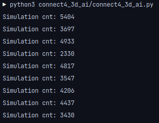
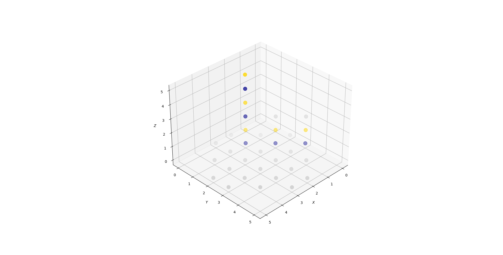

# Master the Game of Connect Four 3D

- [Game Rules](#Game-Rules)
- [Introduction to Our AI](#Introduction-to-Our-AI)
- [Methods](#Methods)
- [Conclusion](#Conclusion)
- [Install](#Install)
- [Use MCTS in Python](#Use-MCTS-in-Python)
- [Other tools](#Other-Tools)
- [Todos](#Todos)


## Game Rules

- Board: Unlike ordinary 3D Connect Four, the board is added 8 more cells. [(Example board image refer to this. In this image, gray is the legal next movement, blue is black-player, yellow is white-player.)](https://github.com/LiaoWC/MasterTheGameOfConnect4/blob/main/data/img/Figure_1.png) Total number of cells is 24. Pieces can be stacked in a cell but the maximum number in a cell is 6 (ordinary one is 4).
- Objective: Get more scores than your opponent. Form four-in-a-lines to win scores.
- Score calculation: Four-in-a-lines can be along any direction, and they can have shared pieces. Everytime you accomplish a four-in-a-line, you get  scores. "k" means the line is the k-th line to appear.
- In each move, a player selects one cell that is not full yet (<6) to place a game piece in. The new piece will be at the top of the stack in that cell.
- Each player has 32 game pieces. The depth of the game is 64 moves in total.

*Game rule description is modified from the project spec of the course "AI Capstone" in NYCU.

## Introduction to Our AI

We designed an MCTS-based AI with dominant pruning. It is basically standard MCTS, but we do something a little
different which will be described later to get better result. The followings are what our AI do in the four phases for
MCTS.

- Select: In this phase, our AI try to find a leaf node for next phase to expand. Here we used PUCT for select one child
  in many children. (Detailed Explanation for PUCT can be seen in method 2 - PUCT)

- Expand: After obtain a node from the select phase, our AI will expand the node with dominant pruning. (Detailed
  explanation for dominant pruning can be seen in method 3 - Dominant Pruning)

- Playout: Randomly play the game to the end(there are 64 pieces on the board) and check if there's someone wins, or
  it's a tie game.

- Backup: With the result obtaining from simulate phase, update visiting_count and value_sum of each node from current
  node to root node.

## Methods

### 1. Neural network and AlphaZero-like Training

AlphaZero is a well known AI program that uses MCTS, neural network and reinforcement learning to master games such as
go, shogi, and chess. We refer to its training algorithm and apply to this game. In our implementation, the 4 main
components of it are *actor*, *learner*, *replay buffer*, and *controller*.

- Actor: fetch the newest neural network model to do self-play.
- Learner: train neural network model every time when enough self-playing data generated.
- Replay buffer: manage self-playing data and let training do experience replay.

Neural network we design is:  


Loss function:  

(z is the true value of the state and v is predicted value; \pi is the true MCTS policy distribution and \bm p is
predicted policy; the last term means L2 regularization.)



We find using neural network as a evaluation function on CPU works. It receives enough MCTS simulation in the limited
time. Neural network model has the potential to master the game. However, we find the computing cost and time cost of
self-play is too large by just using resources on Google Colab. Number of learnable parameters in our model varies from
ten of thousands to hundred of thousands, depending on model settings. Assume 1 state (we can imagine it as a move) can
be generated by self-playing in 1 second. We can only generate 86400 states a whole day, not mentioned to other overhead
we haven't count. Due to the limit, we stop training neural network model and pay entire attention on other search
strategies. From this experiment, we experience that how large computing resources it needs to training something like
AlphaGo. After doing this, we personally realize that why those big companies like Google, Facebook always stands on the
cutting edge of technology. That's because they have lots of resources to invest in researches.

### 2. PUCT

Ordinary UCB function is
, where w is value sum, n is child visit count, N is parent visit count, and c is a constant.

PUCT is **P**redictor + **UC**B applied to **t**rees. We design a new formula using *connect and block prior* (detailed
will be discussed in next part) as a predictor. The formula is
, where the w, n, N has the same meaning as UCB, p is the prior gotten from *connect and block
prior*, and c is a constant which we pick 1.414.

We regard the predicator as an improvement of exploration, that is we can explore the node which we think is better
earlier and more. How the predicator is calculated is introduced in method 3.

### 3. Connect and Block Prior

We design a simple way to evaluate the prior of each move and use it in PUCT in order to explore the node which we think
is better earlier and more. While dominant pruning (detailed is in part 4) deals with the case when there will be
connected-4 on the board after the move, connect and block prior deal with the case when there will be connected-3 on
the board after the move.

If the move can generate a connected-3, it can get base c\*2 points to its prior (The base c here is a hyper-parameter
for controlling the weight of connect and block prior). If the move can prevent opponent from getting live-connected-3 (
can connect a 4-stone-line in two ends), it can get base c points to its prior. Take the picture down below as an
example, white should go next. Consider the move (2, 0), there will be white connect-3, so the move (2, 0) has prior 2c.
Then consider the move (1, 1), it can prevent black get life connected-3 in the direction, so the move (1,1) has prior
c.



### 4. Dominant Pruning

The formula for calculating scores
is , where k is the line's
connecting order. From our observation, those player who connect a line first usually has better performance in a game.
Thus, we view the move that lead to connect a line as a ***dominant*** move. In contrast to a dominant move, we call a
dominant move's parent move a ***dominated*** move.

A dominant's move's parent move is opponent's move. Use induction we know that if a move is dominant, then its opponent
won't play the parent move. Therefore, its reasonable to prune the parent move since the opponent will tend not to play
there if it's national. By doing *dominant pruning*, we can decrease unimportant subtrees and better the efficiency of
MCTS. Most important is that if we do dominant pruning when expanding root node and root's child nodes, it prevents the
AI from not blocking opponent's connecting opportunity, and it ensure the AI will not miss the chance to connect a line.



## Conclusion

When running MCTS, there are two issues are significant:

1. How to address exploration or exploitation problem?
2. How to evaluate a state?

For multi-bandits problem, we use ***connect and block prior*** and ***PUCT*** to improve the exploration, helping AI to
do better selection. As for the evaluation function, using neural network sounds fancy but its cost of time and
computing resources is too large. To trade off, use human brain to design the algorithm is feasible for us. We believe
that playout is a suitable way to evaluate when we run enough times of MCTS.

MCTS converges to Minimax result for infinite runs. We can help it recognize a node's game outcome earlier to accelerate
the search with the method ***dominant pruning***. We take advantage of domain specific knowledge to prune out dangerous
moves. It not only improve the strength but also improve the search efficiency.

## Install

### First time

Some dependencies may need to be installed. Ensure you have all of those.

- cmake (https://cmake.org/install/)
- pytest
- pybind11

```shell
# Example install commands.
# Find your best ways for your system.
sudo apt-get install python3-dev  # for python3.x installs
sudo apt-get install libeigen3-dev
pip install pytest
pip install pybind11
# If cannot find Eigen
sudo ln -s /usr/include/eigen3/Eigen /usr/include/Eigen
```

```shell
# Git clone this repository and enter the directory.
git clone https://github.com/LiaoWC/MasterTheGameOfConnect4.git
git submodule init && git submodule update
cd MasterTheGameOfConnect4
```

### Re-compile after modification

- Compile C++ codes
   ```shell
   cmake .
   make
   ```
- If you only modify Python codes, you may have no need to re-compile.

This project's executable file will be generated in this project's root directory. The .so file compiled from C++ for
python will be generated in "connect4_3d_ai/".

## Use MCTS in Python




```python
import connect4_3d_ai_engine
```

## Other Tools

### Print board


Instructions:

1. Call the c++ function to output board content.
   ```c++
    Node *cur_node = ......
    cur_node->output_board_string_for_plot_state();
    // This will output the board content to a file named "board_content_for_plotting".
    ```
2. Run python to show the graph.
    ```shell
    python3 plot_state.py ......
    # Usage:
    # (1)
    python3 plot_state.py random  
    # (2)
    python3 plot_state.py board_string_text_file_path  
    # (3)
    python3 plot_state.py board[0][0][0] board[0][0][1] ... (size length * size length * size length values totally)  
    ```

Gray is the legal next movement.  
Blue is black-player.  
Yellow is white-player.

## Todos

- [ ] Pack up Python and so file.
- [ ] Add problem settings.
- [ ] Print board in Python.
- [ ] Check latex on GitHub readme.
- [ ] Integrate neural network with C++ version.
- [ ] Multi-process to run MCTS and inference with a batch.
- [ ] The config file seems useless in self-playing dir. Integrate it with others.
- [ ] Is it a good idea to let second hand play at the center?
