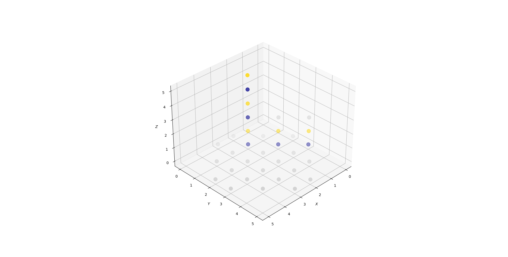

# 

```shell
pip install pytest
pip install pybind11
```
sudo apt-get install python3-dev  # for python3.x installs
sudo apt-get install libeigen3-dev
```shell
# If cannot find Eigen
sudo ln -s /usr/include/eigen3/Eigen /usr/include/Eigen
```
cmake
pytest
pybind11


## TODO / Direction?
- [ ] Multi-threads/processes??? 

## Print board

Instructions:
1. Call the c++ function to output board content.
   ```c++
    Node *cur_node = ......
    cur_node->output_board_string_for_plot_state();
    // This will output the board content to a file named "board_content_for_plotting".
    ```
2. Run python to show the graph.
    ```shell
    python3 plot_state.py ......
    # Usage:
    # (1)
    python3 plot_state.py random  
    # (2)
    python3 plot_state.py board_string_text_file_path  
    # (3)
    python3 plot_state.py board[0][0][0] board[0][0][1] ... (size length * size length * size length values totally)  
    ```
Gray is the legal next movement.  
Blue is black-player.  
Yellow is white-player.  


### Random
```c++
#include <random>
#include <iostream>

int main() {
    int max_number = 10;
    int n_random = 10000;

    std::random_device rd;
    std::mt19937 rng(rd());
    std::uniform_int_distribution<std::mt19937::result_type> dist(1, 10);

    std::vector<int> record(max_number, 0);
    for (int i = 0; i < 1000000; i++) {
        int number = dist(rng);
        record[number-1]++;
    }
    for (int i =0;i<record.size();i++){
        std::cout << i+1 << ": " << record[i] << std::endl;
    }
    return EXIT_SUCCESS;
}
```